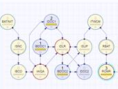

# workflow-svg.js

Deployed at https://brettonw.github.io/workflow-svg.js/

## Introduction

## Workflow Networks
A Workflow Network is simply a network, or a directed graph. It may have cycles. The unique characteristic is that workflows have a main line. There are one or more expected entry points, and one or more expected exit points. It might look something like this:

